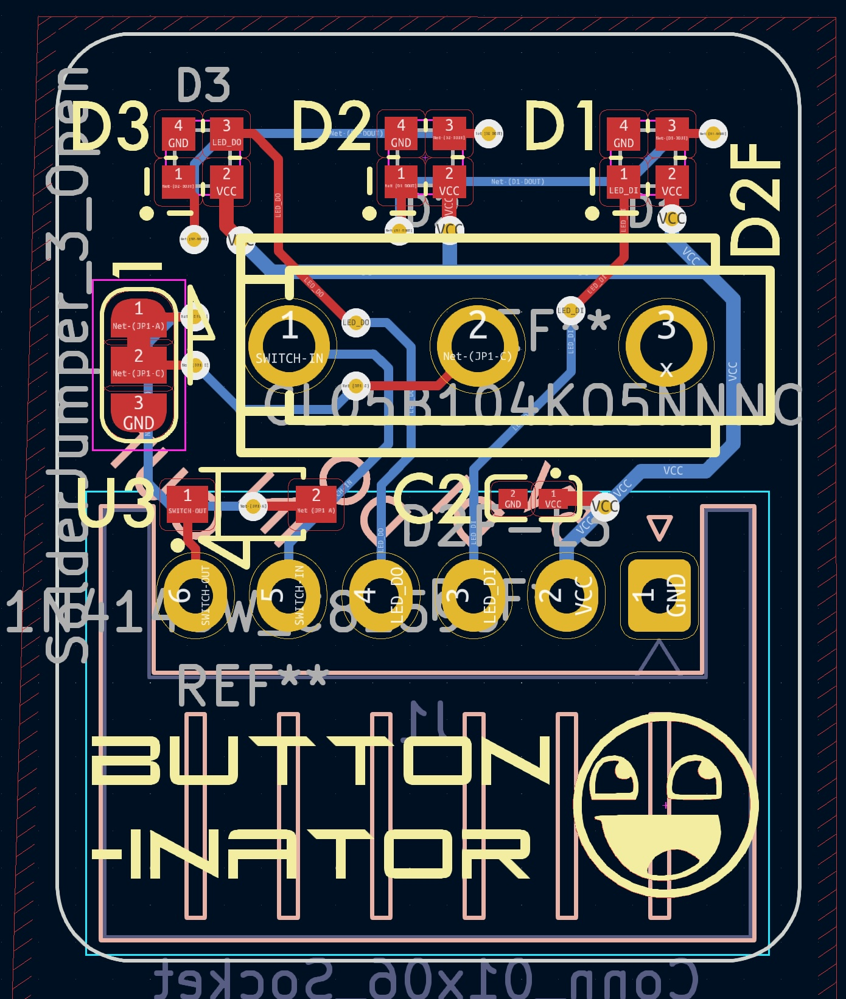
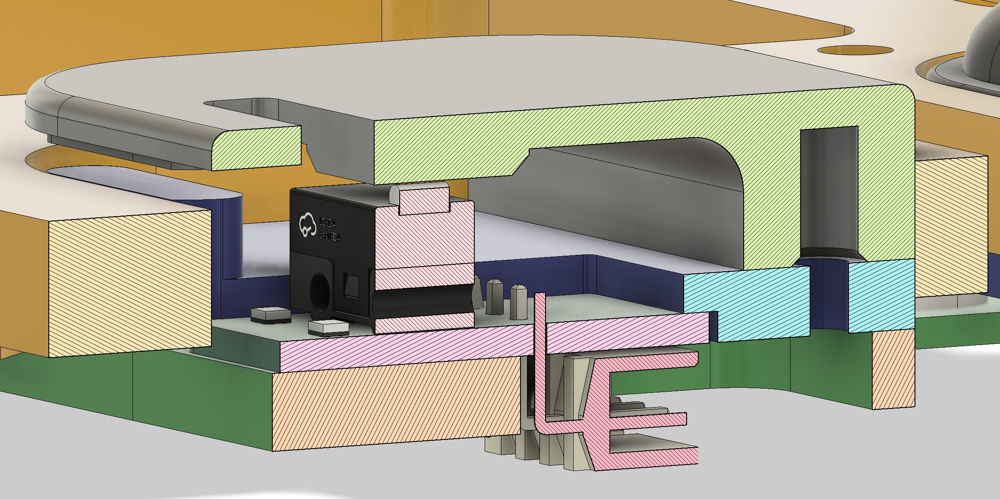
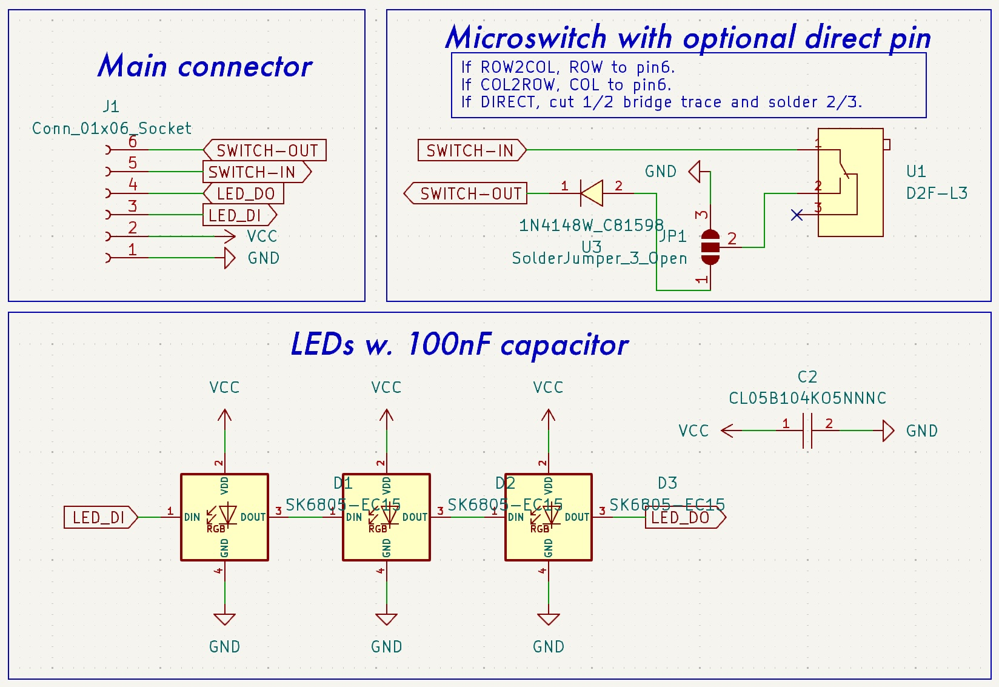
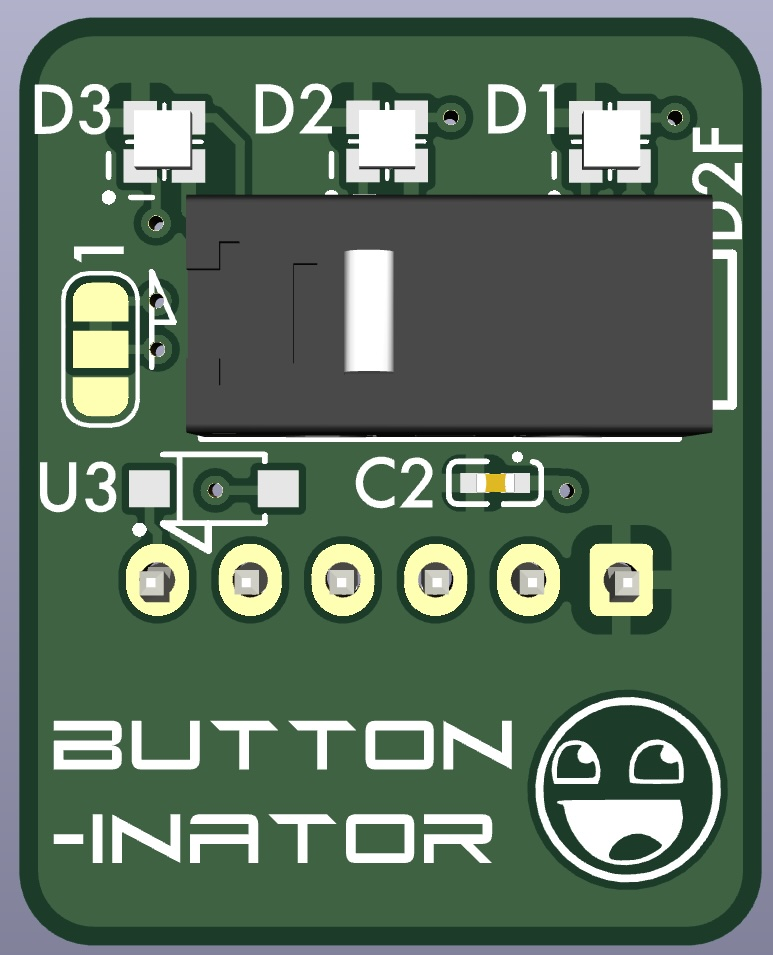
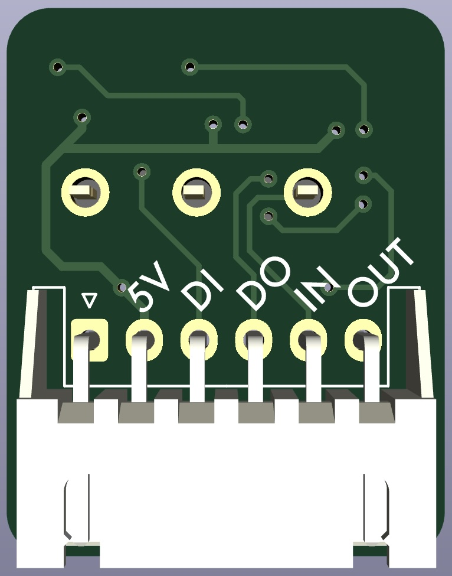

# microswitch-pcb
Designed for use on the [ArcPedals mk2](https://github.com/christrotter/qmk_firmware/tree/arcboard-series/keyboards/handwired/arcpedals_mk2) - with the accompanying files, a drop-in replacement for the old MX-based switches.

JLC wanted to charge me extra for using SK6812-MINI-E leds, so I swapped over to the SK6805 and tripled the led count.  As one does.

# Schematic overview
Pretty straightforward.
- 2.54 header (I designed for JST-XH 2.54 horizontal)
- 5v/GND power system w. 100nF capacitor
- LED signal via DI/DO pins
- 'key' signal via IN/OUT pins w. default diode on return leg, optionally cut the bridge and solder pads 1/2 together (for the direct pin users)
- designed for Omron D2F microswitches

# 3d view

